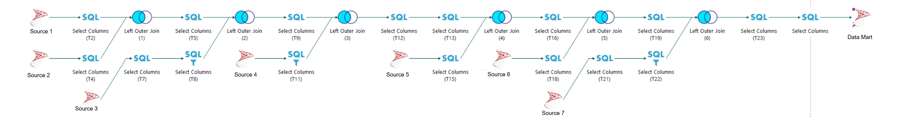
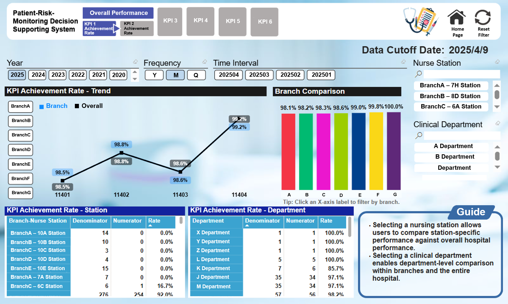

# powerbi-patient-risk-monitoring

"A Power BI KPI monitoring system that improved reporting efficiency by 75% and achieved 90% KPI attainment."

This project focuses on building a Power BI decision support system for monitoring key healthcare quality KPIs across multiple divisions.
It covers the full lifecycle from requirements gathering, Data Mart construction, ETL data cleaning, automated data refresh, dashboard development, and Row-Level Security (RLS) implementation.

---

## 📌 Project Overview

To support healthcare quality improvement initiatives, we developed a dynamic KPI monitoring dashboard, replacing previous weekly and monthly static reports.
This new system enhances real-time visibility and operational efficiency for frontline healthcare teams and management.

---

## 🧰 Features

- **Requirements Gathering and Indicator Refinement**  
  Collaborated with frontline staff to refine existing KPI definitions and propose new indicators.

- **Data Mart Construction**  
  Integrated multi-source data using ETL tools and built a centralized Data Mart tailored for dashboard consumption.

- **ETL Data Pipeline Automation**  
  Designed ETL workflows for daily automated updates, eliminating the need for manual reporting and emailing routines.

- **Dynamic Dashboard Development**  
  Developed Power BI dashboards featuring:
  - 7 key performance indicators (KPIs)
  - Trend analysis and division comparisons
  - Interactive filters (year, quarter, clinical department, nursing station)

- **Row-Level Security (RLS)**  
  Implemented RLS for controlled data access based on user roles.

- **Efficiency Gains**  
  - Reduced manual processing time from 15 hours/month to 3.67 hours/month
  - Achieved approximately 75% improvement in data update efficiency
  - Improved data timeliness, security, and flexibility
 
- **KPI Performance**  
  - Achieved a 90% indicator achievement rate after system implementation, enabling better tracking and management visibility
    
---

## 🧱 Tech Stack

| Tool          | Purpose                          |
|---------------|----------------------------------|
| SQL Server    | Data integration and extraction  |
| ETL Tools     | Data cleaning and transformation |
| Power BI      | Data modeling, visualization, and RLS |
| DAX           | KPI calculations and filtering   |

---

## 📈 Workflow Overview

1. **Requirements Analysis** → 2. **Data Mart Building** → 3. **ETL Process Design** → 4. **Power BI Development** → 5. **Deployment and Maintenance**

Example ETL Flow Diagram:



ETL flow diagram showing multi-source joins and transformations to build a unified Data Mart.

## Main Dashboard (Restricted View)


Simulated restricted view - for demonstration purposes only.

## Main Dashboard (Authorized View)



This dashboard allows comparison between individual divisions and overall hospital performance through interactive filters.

## Main Dashboard (Branch Selected)


Shows the KPI trend lines for both the selected branch and overall hospital simultaneously, enabling direct visual comparison.
(Tip: By selecting a branch from the left panel or clicking the X-axis labels in the bar chart, users can instantly filter and compare that branch's KPI achievement against the overall performance.)

## 📝 Additional Notes
Selecting a nursing station allows users to compare station-specific performance against overall hospital performance.  
Selecting a clinical department enables department-level comparison within branches and the entire hospital.  

---

## 📊 DAX Sample Calculations

The following DAX measures calculate the achievement rate of a key healthcare quality KPI.  
Although both measures are based on the same core formula, different filter contexts are applied to enable simultaneous comparison between the overall performance and branch-level performance.

### KPI Achievement Rate - Overall

```DAX
KPI_AchievementRate_Overall = 
CALCULATE(
    DIVIDE(
        SUM('column_name'[numerator]),
        SUM('fact_assessment'[denominator])
    ),
    FILTER(
        ALLEXCEPT(
            'fact_assessment',
            'fact_assessment'[Time_Interval],
            'fact_assessment'[Frequency],
            'fact_assessment'[Year],
            'fact_assessment'[Department]
        ),
        'fact_assessment'[Hospital_Branch_Order] = "0.All"
    )
)
```
Explanation:
KPI_AchievementRate_All calculates the overall achievement rate across all branches combined.

 
### KPI Achievement Rate - Branch

```DAX
KPI_AchievementRate_Branch = 
CALCULATE(
    DIVIDE(
        SUM('fact_assessment'[numerator]),
        SUM('fact_assessment'[denominator])
    ),
    FILTER(
        'fact_assessment',
        'fact_assessment'[Hospital_Branch_Order] <> "0.All"
    )
)
```
Explanation:
KPI_AchievementRate_Branch calculates the achievement rate for each individual branch separately.

## 🔒 Notes on Privacy and Anonymization
All datasets used in this project were anonymized before processing.

Sensitive patient information was removed to comply with privacy regulations. 

The dashboard only presents aggregated data for statistical and operational improvement purposes.
